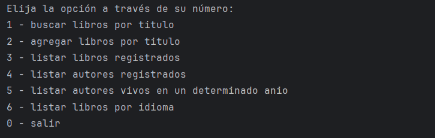

# Alura Latam - Oracle ONE - Backend

## Table of contents

# Table of Contents

- [Overview](#overview)
- [Screenshot](#screenshot)
- [My process](#my-process)
- [Built with](#built-with)
- [Java Project with Spring Boot](#java-project-with-spring-boot)
- [Requirements](#requirements) - [Dependencies](#dependencies)
- [Build Configuration](#build-configuration)
- [Project Features](#project-features)
- [Summary](#summary) - [What I learned](#what-i-learned)
- [Author](#author) - [Course](#course)

## Overview

### Screenshot



## My process

### Built with

## Java Project with Spring Boot

### Requirements

- Java 17

### Dependencies

These are the dependencies used in the project:

- `com.fasterxml.jackson.core:jackson-databind:2.18.0`
- `org.springframework.boot:spring-boot-starter-data-jpa`
- `org.postgresql:postgresql` (runtime)
- `org.springframework.boot:spring-boot-devtools` (runtime, optional)
- `org.springframework.boot-starter-test` (test)

### Build Configuration

The project uses the Maven plugin for Spring Boot:

```xml

<build>
    <plugins>
        <plugin>
            <groupId>org.springframework.boot</groupId>
            <artifactId>spring-boot-maven-plugin</artifactId>
        </plugin>
    </plugins>
</build>
```

## Project Features

1. **Database Storage**: The project uses PostgreSQL for storing data.
2. **Database Interaction**: It interacts with the database using Spring Data JPA.
3. **Console-Based**: All interactions and operations are performed through the console.

### Summary

This project is designed to manage books and authors. It leverages PostgreSQL for robust data storage and utilizes
Spring Data JPA for seamless database interactions. The entire application runs in a console environment, providing a
straightforward and user-friendly interface for managing book-related operations.

### What I learned

In this lesson, I learn how to encode about the consume APIs, I can create a simple menu
about Book and authors.

- API:  [gutendex](https://gutendex.com/)

To see how you can add code snippets, see below, about filterRates:

## Author

- Website - [Juan Pablo Cristancho](https://my-portafolio-mygi-dvu8swsn6-juan-cris-projects.vercel.app)

## Course

- [Oracle ONE](https://my-portafolio-mygi-dvu8swsn6-juan-cris-projects.vercel.app)
- [Alura](https://www.linkedin.com/company/alura-latam/mycompany/)

